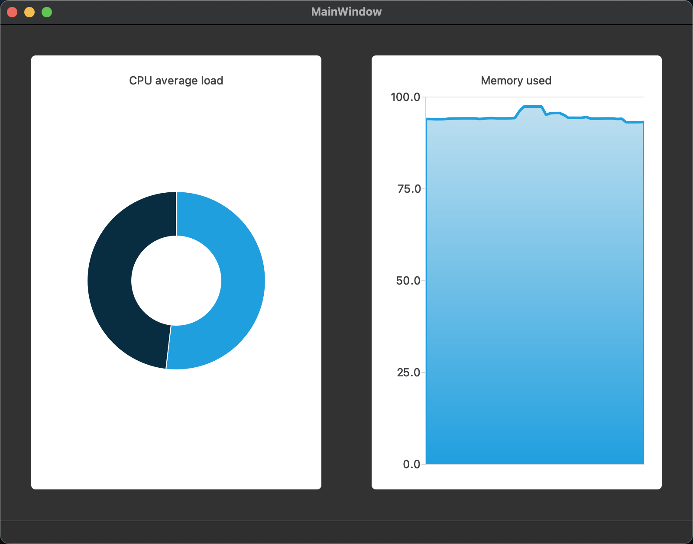
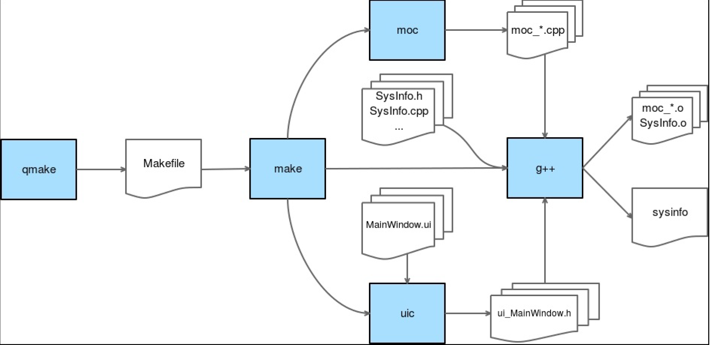

# sys info
- 跨平台代码，支持Windows、Mac OS、Linux。使用了单例模式和策略模式
- 继承结构中，子类快捷键插入父类的虚函数,先鼠标选择声明的子类：1）Mac：[option] + [Enter] 2）Windows/Linux: [Alt] + [Enter]

## qBound()
- template <typename T> const T &qBound(const T &min, const T &val, const T &max)
- Returns val bounded by min and max. 
## 判断平台
```C++
#ifdef Q_OS_WIN
    static SysinfoWindowsImpl singleton;
#elif defined(Q_OS_MAC)
    static SysInfoMacImpl singleton;
#elif defined(Q_OS_LINUX)
    static SysInfoLinuxImpl singleton;
#endif
```

## 显示系统的CPU和内存


---

# .pro文件
- #：注释一行
- QT：此项目中使用的Qt modules列表
- CONFIG：此项目中使用的配置选项
- TARGET：目标输出文件的名字
- TEMPLATE：当生成二进制文件时项目的模版，例如app,lib,subdirs
- 平台下使用
    ```qmake
    windows {
    SOURCES += SysInfoWindowsImpl.cpp
    HEADERS += SysInfoWindowsImpl.h
    }
    linux {
    }
    unix {
    }
    macx {
    }
    ```

- 嵌套使用
    ```qmake
    windows {
        SOURCES += SysInfoWindowsImpl.cpp
        HEADERS += SysInfoWindowsImpl.h
        debug { # 等价于if (windows && debug)
            SOURCES += DebugClass.cpp
            HEADERS += DebugClass.h
        }
    }
    ```

- 条件判断
    ```qmake
    windows|unix {
        SOURCES += SysInfoWindowsAndLinux.cpp
    } else:macx {
        SOURCES += SysInfoMacImpl.cpp
    } else {
        SOURCES += UltimateGenericSources.cpp
    }
    ```
---
## 操作符说明
- =：给变量赋值
- +=：给变量列表添加值
- -=：给列表移除值
- *=：仅在该值不存在的情况下才添加到列表中
- ～=：用指定的值替换符合正则表达式的任意值
---
## 函数
- 定义一个变量，并使用message()函数，此函数编译时会发出信息在编译输出框
    ```qmake
    COMPILE_MSG = "Compiling on"
    windows {
    # 编译框输出 Project MESSAGE: Compiling on windows
        message($$COMPILE_MSG windows) 
    }
    ```

- error(string)：显示字符串并立即退出编译
- exists(filename)：测试是否存在filename
- include(filename)：将其它.pro文件添加进来
---
## qmake编译过程
- 蓝色方框是命令，波浪形方框是文件


1）【qmake】命令与.pro文件一起执行，在项目文件基础上生成一个Makefile文件

2）【make】命令调用其他命令来生成中间文件

3）【uic】命令全称User Interface Compiler。此命令会将所有的.ui文件生成相关的ui_*.h头文件以便能在自己对应的.cpp文件引用

4）【moc】命令接收每一个包含Q_OBJECT宏的类(与超类QObject配对)，并生成中间moc_*.cpp文件，里面包含了信号槽工作所需的一切

5）【g++】命令被执行，将所有源文件和中间的moc文件编译成.o文件，最后链接成二进制可执行程序

---

# Q_OBJECT 和 signals/slots
## Q_OBJECT宏展开

```C++
#define Q_OBJECT \
public: \
    QT_WARNING_PUSH \
    Q_OBJECT_NO_OVERRIDE_WARNING \
    static const QMetaObject staticMetaObject; \
    virtual const QMetaObject *metaObject() const; \
    virtual void *qt_metacast(const char *); \
    virtual int qt_metacall(QMetaObject::Call, int, void **); \
    QT_TR_FUNCTIONS \
private: \
    Q_OBJECT_NO_ATTRIBUTES_WARNING \
    Q_DECL_HIDDEN_STATIC_METACALL static void qt_static_metacall(QObject *, QMetaObject::Call, int, void **); \
    QT_WARNING_POP \
    struct QPrivateSignal {}; \
    QT_ANNOTATE_CLASS(qt_qobject, "")
```
- QMetaObject类的作用是为QObject子类存储所有的元信息；还维护类的信号和槽之间的对应表，以及任何连接的类的信号和槽对应表。每一个信号槽都被分配了一个唯一的索引：
- metaObject()函数对于普通的Qt类返回&staticMetaObject；处理QML对象返回dynamicMetaObject
- qt_metacast()函数使用类的名称进行动态转换。这个函数是必须的，因为Qt不依赖标准C++RTTI（运行时类型信息）来检索关于一个对象或一个类的元数据
- qt_metacast()直接通过索引调用一个内部信号或槽。因为使用的是索引而不是指针，所以没有指针的指针解读，生成的switch case可以被编译器大量优化（编译器可以在很早的时候直接包含跳转指令到特定的情况，避免大量的分支评估）。因此，信号/槽机制的执行是相当快的

---

## siganls/slots/emit
- 定义
    ```C++
    #define slots
    #define signals public
    #define emit
    ```

- 当一个信号关键词被发射，QMetaObject::activate()被调用并带有改变的值和信号索引
- QObject::connect()：创建一个新的Connection,在qobject_p.h定义
```C++
struct Connection
{
    QObject *sender;
    QObject *receiver;
    union {
        StaticMetaCallFunction callFunction;
        QtPrivate::QSlotObjectBase *slotObj;
    };
    // The next pointer for the singly-linked ConnectionList
    Connection *nextConnectionList;
    //senders linked list
    Connection *next;
    Connection **prev;
    //...
};
```
- Connection实例存储了一个指向信号发射器类(sender)、槽接收器类(receiver)的指针，及连接的信号槽关键字的索引。当一个信号被发射出去，每一个连接的槽都必须被调用。为了能做到这一点，每一个QObject为它每个信号都有一个Connection实例的链接列表，它的每个槽关键字也有同样的Connection链接列表
- 这对链接列表允许Qt正确地走到每个依赖槽/信号对，以使用索引触发正确的函数。同理处理接收器的销毁。Qt走过双链接列表，将对象从它连接的地方删除
- 这些机制发生在UI线程中。因为QThread类继承了QObject，任何QThread都可以使用信号/槽机制