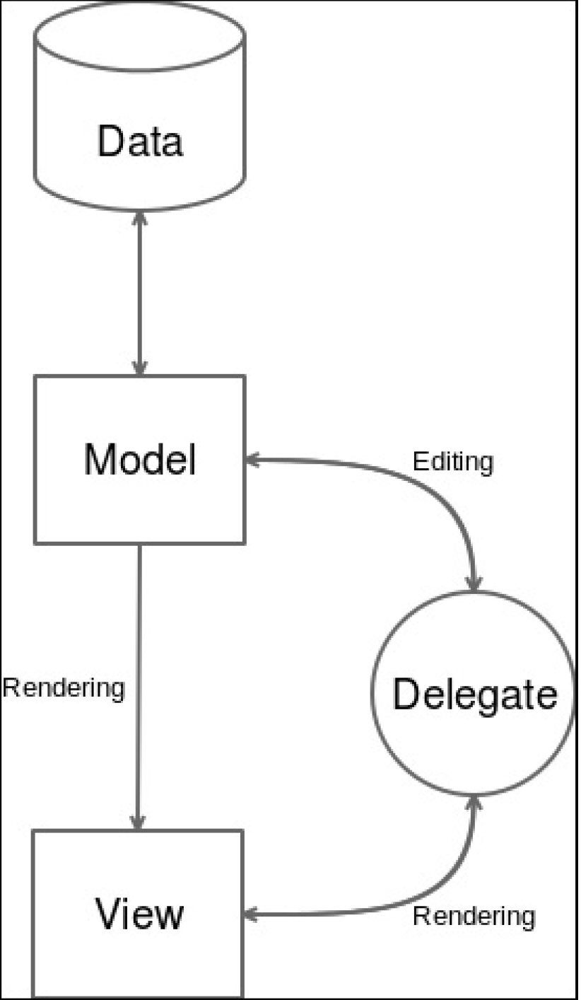

# .pro文件
- `DEFINES += GALLERYCORE_LIBRARY`：编译标志，让编译器知道何时应该导入或导出库的符号
- `gallery-core_global.h`：Qt提供的语法糖，用来减轻跨平台库的痛苦
## gallery-core_global.h
- `Q_DECL_EXPORT`：我们正在编译library库
- `Q_DECL_IMPORT`：我们正在使用共享库编译你的应用程序
- GALLERYCORESHARED_EXPORT宏使符号变为pubic可见
---
- 静态库：1）增加编译时间。每当库有任何修改，就要重新编译。2）更紧密的耦合。多个应用程序不能链接到此库，每一个都必须嵌入此静态库
---
## 数据库 - SQLITE3
> SQLITE3数据库符合我们的使用情况
- 我们使用的数据库情况：1）一个非常简单的数据库模式：不需要复杂的查询。2）很少或没有并发交易：不需要复杂的交易模型。3）一个单一用户的数据库：不需要催生系统服务，数据库存储在一个文件中，不需要多个应用程序访问
---
## MVC(Model View Controller)

- Model管理数据。负责请求数据并更新数据
- View将数据显示给用户
- Controller与Model和View进行交互。它负责为View提供正确的数据，并根据从View收到的用户交互向Model发送命令
### Qt提供的MVC类
- QAbstractItemModel: 这个类最抽象且最复杂
- QStringListModel: 这个类是一个model能够提供strings给views。
- QSqlTableModel (or QSqLQueryModel): 自动处理多个SQL查询，但只适用于非常简单的表结构
- QAbstractListModel: 这个类提供类一个一维列表model。节省了大量的击键，足够灵活
---
## Qt的三种Model类型
1. **List Model**：数据被存储在一个一维数组中(rows)
2. **Table Model**：数据被存储在一个二维数组中(rows and columns)
3. **Tree Model**：数据被存储在一个层次结构关系中(parent/children)
- 为了处理这3种model类型，Qt使用**QModelIndex**这个类处理，例如row(),column(),parent(),child()
- QAbstractItemModel::beginInsertColumns()：通知对于给定的indexes索引，rows行数即将发生变化
- QAbstractItemModel::endInsertRows()：通知rows行已经被更改
- QAbstractItemModel::beginRemoveRows()：开始移除rows行操作
- QAbstractItemModel::endRemoveRows()：结束移除rows行操作。简单触发了模型框架中的自动信号
- QAbstractItemModel::beginResetModel()：开始重置model操作 。重置操作将model重置为任何附加视图中的当前状态
- QAbstractItemModel::endResetModel()：完成重置model操作。必须在重设model或代理model中的任何内部数据结构后调用这个函数