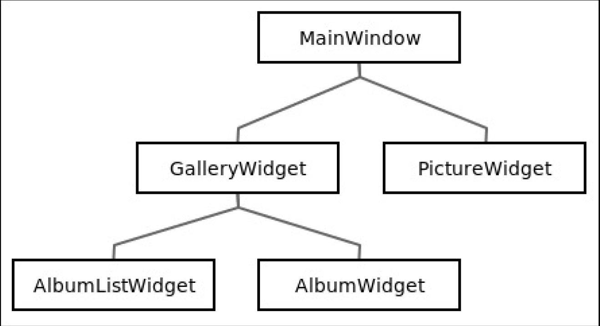

# .pro文件
- LIBS：此变量是链接库到这个工程。-L提供路径，-l提供库名字
    ```qmake
    LIBS += -L<pathToLibrary> -l<libraryName>
    ```

- 指示库头文件的位置
    ```qmake
    INCLUDEPATH += $$PWD/../gallery-core
    DEPENDPATH += $$PWD/../gallery-core
    ```

- `$$PWD`：此变量表示当前.pro文件的绝对路径
- `$$OUT_PWD`：此变量表示输出目录的绝对路径

- depends:表示gallery-core必须在gallery-desktop之前编译built
    ```qmake
    gallery-desktop.depends =  gallery-core
    ```

# UI架构

- MainWindowl类：处理画廊和当前图片之间的切换
- GalleryWidget：1）展示存在的专辑；2）选择专辑；3）创建专辑
- AlbumListWidget：1）显示存在的专辑；2）选择专辑；3）创建专辑
- AlbumWidget：1）以缩略图的形式显示现在图片；2）将图片添加进专辑；3）重命名专辑；4）删除专辑；5）选择图片
- PictureWidget：1）显示选择的图片；2）选择图片；3）删除图片
## 界面的三种视图view
- `QListView`：将模型model中的项目items显示为一个简单的列表
- `QTableView`：将模型model中的项目items显示为一个二维表格
- `QTreeView`：将模型model中的项目items显示为一个列表层次结构

# AlbumListWidget类
- QItemSelectionModel类：Qt类，用于处理视图中的选择。默认视图使用它自己选择的模型。与不同的视图或部件共享相同的选择模型将帮助我们轻松地同步专辑选择

# ThumbnailProxyModel类
> QAbstractProxyModel类继承自QAbstractItemModel
- QAbstractProxyModel类：处理来自QAbstractItemModel类的数据(排序、过滤、添加数据等等)，并通过代理原始模型将其呈现给视图。相当于数据库表的映射
- 有2个子类继承自QAbstractProxyModel：1）QIdentityProxyModel类：改造data()函数合适的类。此类代理它的源模型没有任何修改(所有索引都匹配)。2）QSortFilterProxyModel类：具有排序和过滤传递数据的能力。此类代理它的源模型

# PictureDelegate类
- QStyledItemDelegate类：将缩略图名字放到一个横幅里，此横幅在图片上方相邻
- 创建delegate委托类时，避免直接继承QItemDelegate类，改为继承QStyledItemDelegate类；因为QStyledItemDelegate类支持样式表，允许轻松地定制渲染
- QStyledItemDelegate::createEditor()：一个委托item项目可以用此函数管理编辑过程
---
## 在Qt Designer使用自己的部件
- Qt提供2种方法在Qt designer使用自己的部件：1）**提升widgets**：这是最快和最简单的方法。2）**为Qt Designer创建widget插件**：这是更加强大但更复杂的方法。